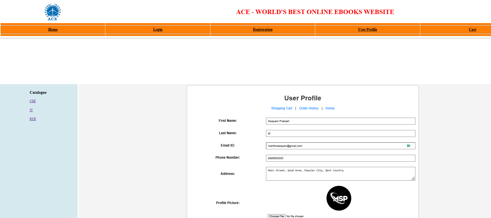
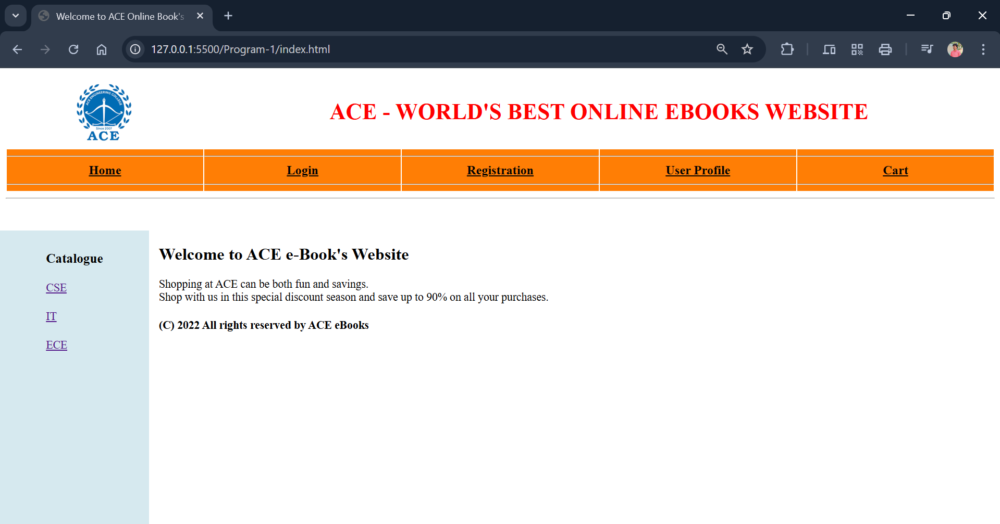
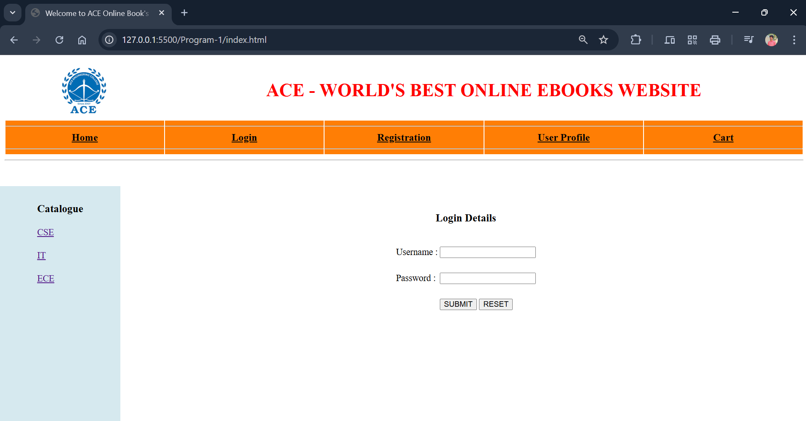
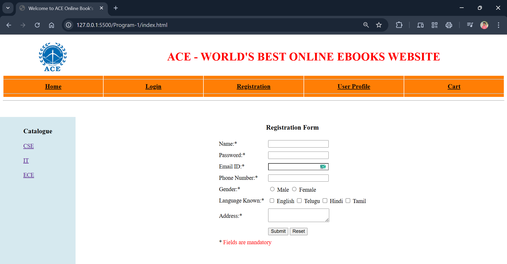
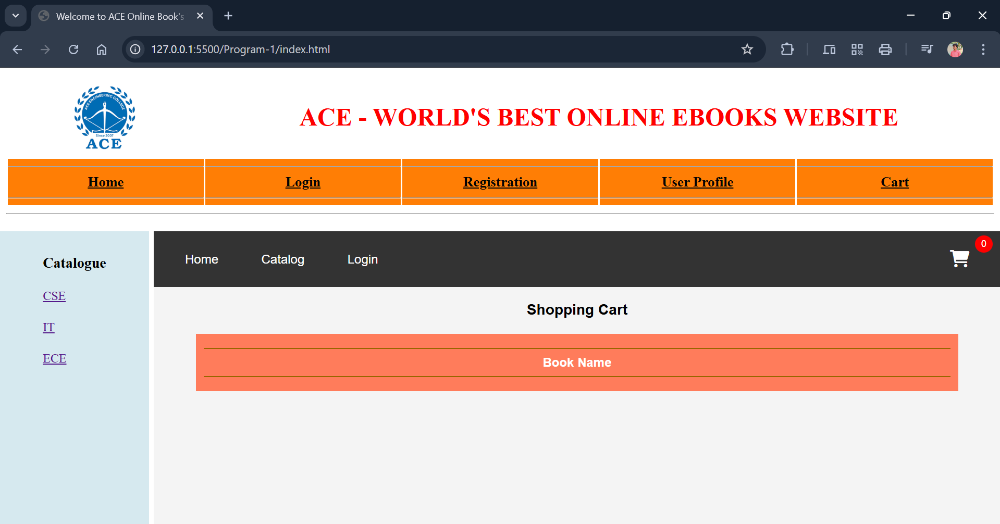
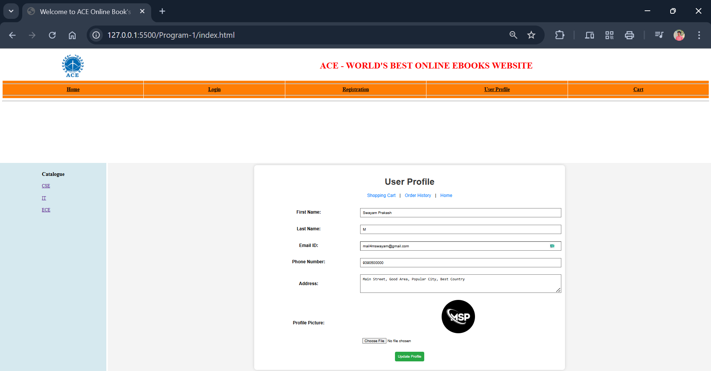

---

## **Program 1 - Responsive Shopping Cart Web Application** 

---

### **AIM**

To create a responsive shopping cart web application using **CSS3**, **Flexbox**, and **Grid** for layout design.

---

### **DESCRIPTION**

This application allows users to register, log in, browse a product catalog, add items to the shopping cart, and view the cart contents. It utilizes CSS3 features such as **Flexbox** and **Grid** for responsive layouts and ensures that the application is **mobile-friendly** and adjusts seamlessly to different screen sizes.

---

### **Project Structure**

```
ShoppingCartApp/
│── public/
│   ├── css/
│   │   ├── utils.css        # Styles for the navigation bar
│   │   ├── index.css        # Styles for catalog items
│   │   ├── cart.css         # Styles for the shopping cart page
│   │   ├── login.css        # Styles for the login page
│   │   ├── register.css     # Styles for the registration page
│   ├── images/              # Folder for storing images
│   ├── js/
│   │   └── script.js        # Main JavaScript file
│   ├── html/
│   │   ├── index.html       # Main HTML file
│   │   ├── cart.html        # Shopping cart page
│   │   ├── login.html       # Login page
│   │   ├── register.html    # Registration page
│── server.js                # Node.js Express server
│── package.json             # Project dependencies and scripts
│── README.md                # Project documentation
```

---

### **Output**

   User Profile:
   

   Home:
   

   Login:
   

   Registration Form:
   

   Shopping Cart:
   

   User Profile:
   

---
### **Installation & Setup**

#### **Prerequisites**

• Install **Node.js** and **npm**

#### **Steps to Run the Project**

1. Clone the repository:

   ```bash
   git clone https://github.com/swayamprakashm/Skill-Development-Lab/Experiment-01_Shopping-cart-app_CSS/Shopping-cart-app.git
   ```
2. Navigate to the project directory:

   ```bash
   cd shopping-cart
   ```
3. Install dependencies:

   ```bash
   npm install
   ```
4. Run the server:

   ```bash
   node server.js
   ```
5. Open your browser and visit:

   ```
   http://localhost:3000
   ```

---

### **License**

This project is **open-source** and free to use.

---

### **Developed by:**

•**M. Swayam Prakash**

•GitHub: [https://github.com/swayamprakashm](https://github.com/swayamprakashm)

---