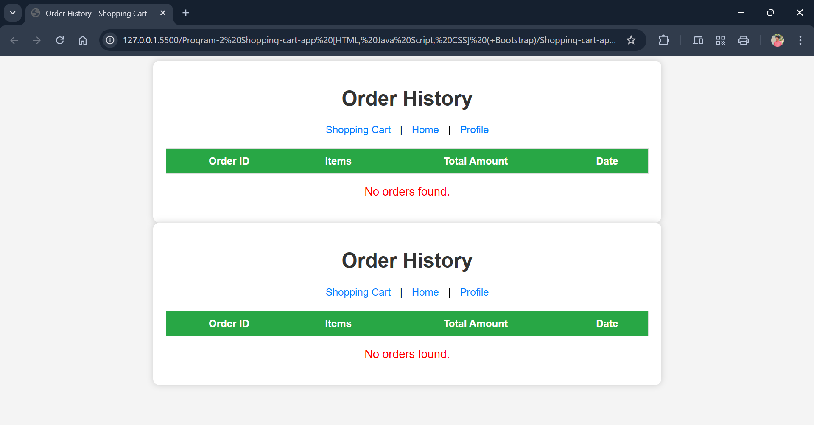
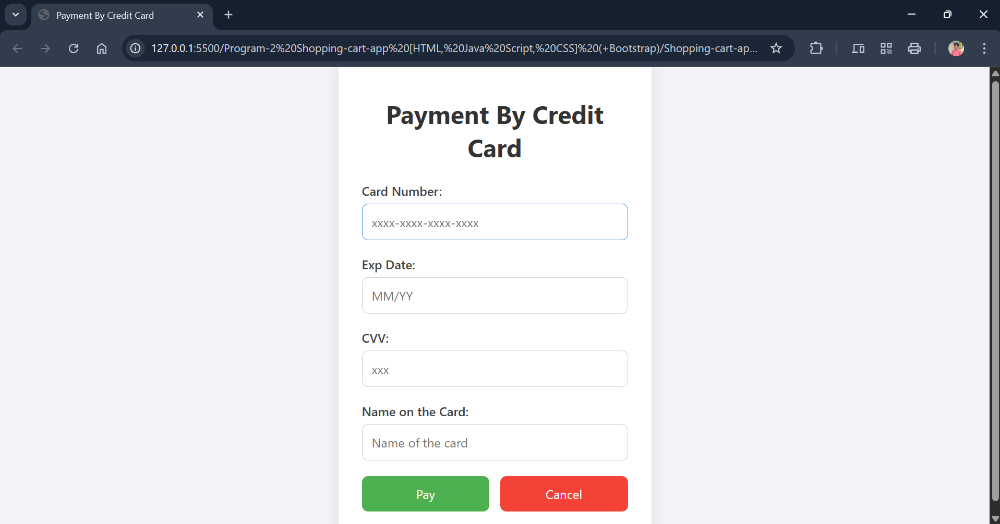

---

## **Program 2 - Make the above web application responsive web application using Bootstrap framework** 

---

### **Overview**

**ShoppingCartApp** is a web-based payment system that allows users to pay by credit card. This version of the application has been made responsive using the Bootstrap framework, ensuring a seamless experience across various devices.

---

### **Features**

•Responsive design using Bootstrap 5

•Credit card payment form with fields for cardholder name, card number, expiration date, and CVV

•Modern and clean UI

•Mobile-friendly layout
---

### **File Structure**

```
ShoppingCartApp/
│── public/
│ ├── css/
│ │ ├── paybycreditcard.css
│ ├── html/
│ │ ├── paybycreditcard.html
```
---

### **Output**

Order History:


Payment:


---

### **Technologies Used**

* **HTML5**
* **CSS3**
* **Bootstrap 5**

---

### **Setup Instructions**

1. **Clone the repository**:

   ```bash
   git clone https://github.com/swayamprakashm/Skill-Development-Lab/Experiment-02_Shopping-cart-app_Bootstrap/ShoppingCartApp.git
   ```

2. **Navigate to the HTML directory**:

   ```bash
   cd ShoppingCartApp/public/html
   ```

3. **Open the payment form in a web browser**:

   ```
   paybycreditcard.html
   ```

---

### **How to Use**

1. Enter the **Cardholder's Name**, **Card Number**, **Expiration Date**, and **CVV**.
2. Click the **Pay Now** button to simulate payment processing.

---

### **Bootstrap Integration**

The **Bootstrap 5** framework is linked via CDN in the `<head>` of `paybycreditcard.html`:

```html
<link href="https://cdn.jsdelivr.net/npm/bootstrap@5.3.0/dist/css/bootstrap.min.css" rel="stylesheet">
```

This ensures responsive grids, form controls, buttons, and layout utilities are available out of the box.

---

### **License**

This project is **open-source** and free to use.

---

### **Developed by:**

•**M. Swayam Prakash**

•GitHub: [https://github.com/swayamprakashm](https://github.com/swayamprakashm)

---