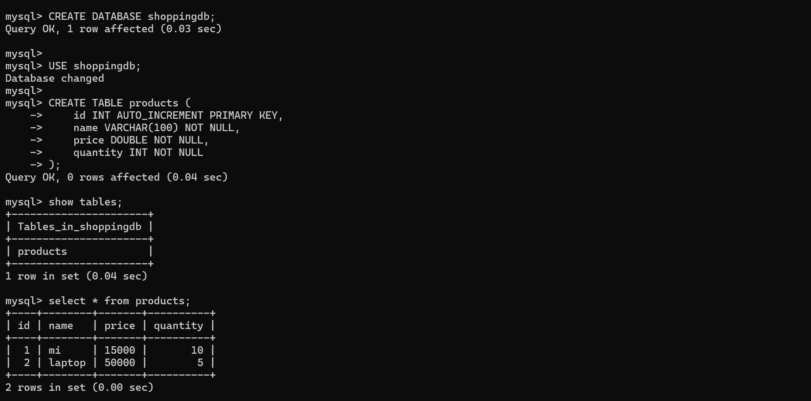
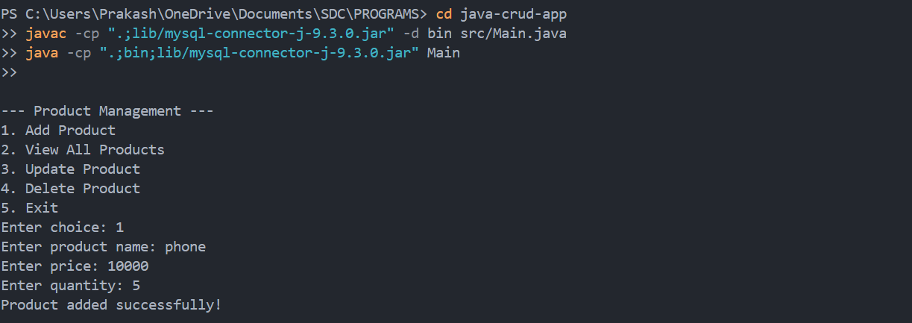

---

## **Program 5: Java Standalone Application with MySQL (CRUD Operations)**

---

### **Objective**

This project is a **Java Standalone Application** that connects to a **MySQL database** and performs **CRUD (Create, Read, Update, Delete)** operations on a `product` table. It’s designed to demonstrate **Java-Database connectivity** using **JDBC**.

---

### **Prerequisites**

Before running this application, make sure you have the following installed:

1. **MySQL Server** – Ensure MySQL is installed and running
2. **MySQL Workbench** – *(Optional)* For GUI-based database management
3. **Java Development Kit (JDK)** – Java 8 or later
4. **VS Code / IntelliJ / Eclipse** – Any IDE that supports Java
5. **MySQL Connector/J (JDBC Driver)** – Required for Java-MySQL connectivity

---

### **Output**

Database:


Java Output:


---

### **Installation & Setup**

#### **Step 1: Install Required Software**

* [Download and install MySQL Server](https://dev.mysql.com/downloads/mysql/)
* [Install MySQL Workbench (optional)](https://dev.mysql.com/downloads/workbench/)
* [Install JDK](https://www.oracle.com/java/technologies/javase-downloads.html)
* [Install VS Code](https://code.visualstudio.com/)
* [Download MySQL Connector/J](https://dev.mysql.com/downloads/connector/j/)

---

#### **Step 2: Configure MySQL Database**

Use MySQL Workbench or terminal to set up the database:

```sql
CREATE DATABASE shoppingdb;

USE shoppingdb;

CREATE TABLE products (
    id INT AUTO_INCREMENT PRIMARY KEY,
    name VARCHAR(100) NOT NULL,
    price DOUBLE NOT NULL,
    quantity INT NOT NULL
);
```

---

#### **Step 3: Set Up Java Project**

**Folder Structure:**

```
java-crud-app/
├── src/
│   └── Main.java
├── lib/
│   └── mysql-connector-j-<version>.jar
└── bin/
```

**Load JDBC Driver in Java:**

```java
Class.forName("com.mysql.cj.jdbc.Driver");
```

**Compile and Run with Classpath:**

```bash
javac -cp ".;lib/mysql-connector-j-9.3.0.jar" -d bin src/Main.java  
java -cp ".;bin;lib/mysql-connector-j-9.3.0.jar" Main
```

---

#### **Step 4: Implement CRUD Operations**

* **Create** – Insert new product
* **Read** – View all products
* **Update** – Modify product details
* **Delete** – Remove product

---

### **Sample Java Code – Database Connection**

```java
import java.sql.*;

public class DatabaseConnection {
    public static void main(String[] args) {
        String url = "jdbc:mysql://localhost:3306/shoppingdb";
        String user = "root";
        String password = "your_password";

        try {
            Connection conn = DriverManager.getConnection(url, user, password);
            System.out.println("Connected to MySQL successfully!");
            conn.close();
        } catch (SQLException e) {
            e.printStackTrace();
        }
    }
}
```

---

#### **Step 5: Running the Application**

**Compile:**

```bash
javac -cp ".;lib/mysql-connector-j-9.3.0.jar" -d bin src/Main.java
```

**Run:**

```bash
java -cp ".;bin;lib/mysql-connector-j-9.3.0.jar" Main
```

**If successful, you'll see:**

```
--- Product Management ---
1. Add Product
2. View All Products
3. Update Product
4. Delete Product
5. Exit
```

---

### **Contributing**

Feel free to fork this repository and suggest improvements via pull requests. **All contributions are welcome!**

---

### **License**

This project is **open-source** and free to use.

---

### **Author**

• **M. Swayam Prakash**

• GitHub: [https://github.com/swayamprakashm](https://github.com/swayamprakashm)

---
