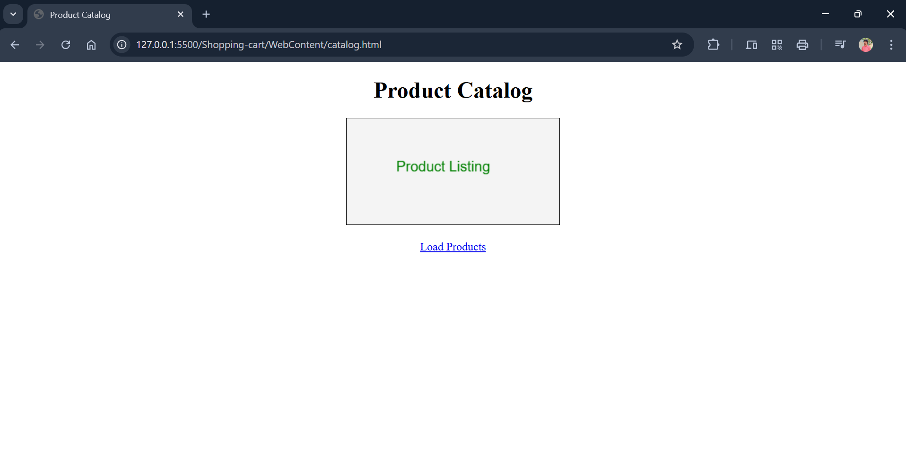
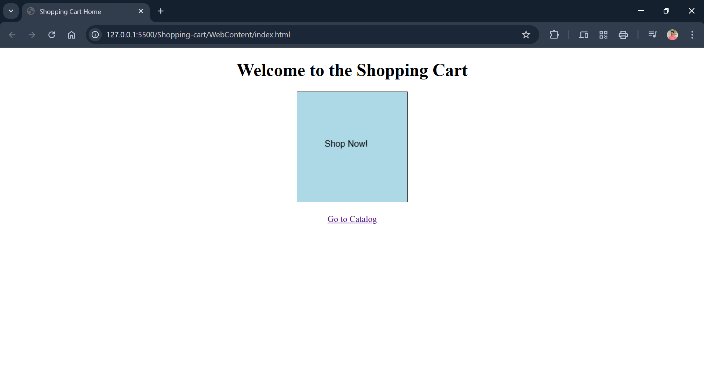

---

## **PROGRAM 7 – Session Management in Shopping Cart Web Application**

---

### **AIM**

To implement **session tracking** in a shopping cart web application using **HTTP Sessions** in **Java Servlets**.

---

### **DESCRIPTION**

This experiment demonstrates how to maintain **user-specific data** (such as a shopping cart) using **HTTP sessions** in Java Servlets. When a user adds products to the cart, the servlet tracks the session and stores cart data in memory without requiring a database write for every interaction.

This implementation improves performance and user experience by **preserving state between page requests**.

The solution uses:

* **Java Servlets** for backend processing
* **HTML/CSS** for the frontend interface
* The built-in **session management API** provided by the Servlet framework

---

### **PROJECT STRUCTURE**

```
shopping-cart-session/
│
├── src/
│   └── servlets/
│       ├── ProductServlet.java         # Lists products
│       └── CartServlet.java            # Handles add-to-cart with session
│
├── WebContent/
│   ├── index.html                      # Welcome page
│   ├── catalog.html                    # Displays product list with add buttons
│   ├── cart.html                       # Displays cart contents from session
│   └── WEB-INF/
│       ├── web.xml                     # Servlet and session config
│       └── lib/
│           └── mysql-connector-j-9.3.0.jar
│
├── bin/                                # Compiled .class files
├── lib/
│   └── javax.servlet-api-4.0.1.jar
├── README.md                           # Project documentation
```

---

### **Output**

Product Catalog page:


Welcome page:


---

### **INSTALLATION & SETUP**

#### **PREREQUISITES**

• Java JDK

• Apache Tomcat

• MySQL

• VS Code with Java Extensions

• Servlet API (`javax.servlet-api-4.0.1.jar`)

---

### **STEPS TO RUN THE PROJECT**

1. **Add Required JARs to `lib/`:**

   * `mysql-connector-j-9.3.0.jar`
   * `javax.servlet-api-4.0.1.jar`

2. **Compile Servlets:**

   ```bash
   javac -cp "lib/*" -d bin src/servlets/ProductServlet.java src/servlets/CartServlet.java
   ```

3. **Deploy to Tomcat:**

   * Copy `WebContent/` into `tomcat/webapps/shopping-cart-session/`
   * Copy compiled `bin/` classes to `WEB-INF/classes/`

4. **Start Tomcat Server**

5. **Visit in Browser:**

   ```
   http://localhost:8080/shopping-cart-session/index.html
   ```

---

### **DATABASE SETUP**

**Database:** `shopping_cart`
**Table:** `products`

```sql
CREATE TABLE products (
  id INT PRIMARY KEY AUTO_INCREMENT,
  name VARCHAR(100),
  price DECIMAL(10,2)
);
```

---

### **LICENSE**

This project is **open-source** and free to use.

---

### **Author**

• **M. Swayam Prakash**

• GitHub: [https://github.com/swayamprakashm](https://github.com/swayamprakashm)

---
>>>>>>> 10b5e9fbd590dd7b6eef73f6e5e409277d3db61f
