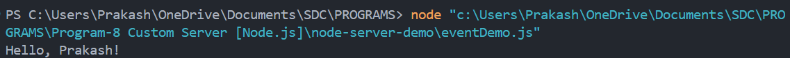
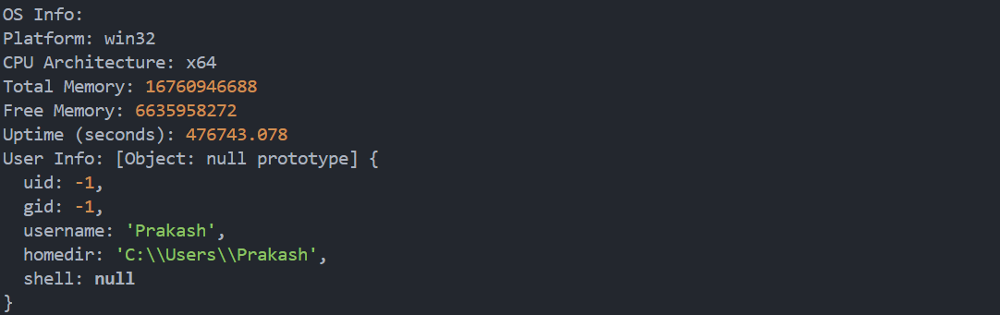
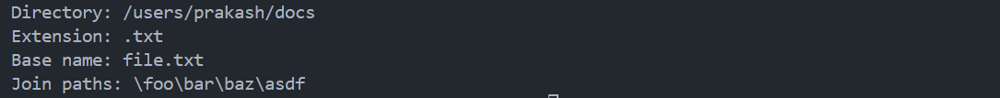
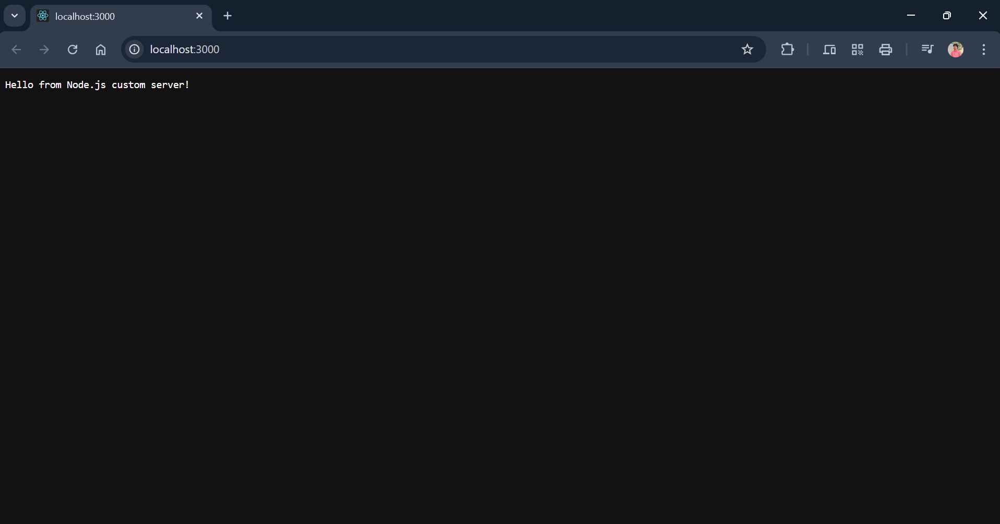

---

## **PROGRAM 8 – Custom Server and Core Modules in Node.js**

---

### **AIM**

To create a custom **HTTP server** using **Node.js** and explore core built-in modules such as `os`, `path`, and `events`. 

---

### **DESCRIPTION**

This experiment demonstrates how to build a simple HTTP server using **Node.js** without any external frameworks. It also showcases how to interact with **system-level information**, **file paths**, and **custom events** using Node.js core modules.

The solution uses Node.js for server-side programming and the built-in `http`, `os`, `path`, and `events` modules to explore their functionalities in a backend environment. This helps in understanding how Node.js handles **server creation** and **system-level operations** using its **standard library**.

---

### **PROJECT STRUCTURE**

```
node-server-demo/
│
├── server.js        # Creates a basic HTTP server
├── osInfo.js        # Displays OS information using 'os' module
├── pathDemo.js      # Demonstrates path operations using 'path' module
├── eventDemo.js     # Emits and listens for events using 'events' module
├── README.md        # Project documentation
```

---

### **Output**

Event Demo page:


OS Info page:


Path Demo page:


Server page:


---

### **MODULES USED**

• `http` – To create the web server

• `os` – To fetch system-related data such as platform, memory, and CPU info

• `path` – To handle file and directory paths

• `events` – To handle event-driven architecture by emitting and responding to events

---

### **INSTALLATION & SETUP**

#### **PREREQUISITES**

• Node.js installed on your system

• Visual Studio Code (VS Code) or any preferred IDE

---

### **STEPS TO RUN THE PROJECT**

1. Open terminal and navigate to the project directory:

   ```bash
   cd node-server-demo
   ```

2. Open the project in VS Code:

   ```bash
   code .
   ```

3. Run each file individually to test different modules:

* **Start the HTTP server:**

  ```bash
  node server.js
  ```

  Then open your browser and visit:
  `http://localhost:3000`

* **Run OS module demo:**

  ```bash
  node osInfo.js
  ```

* **Run Path module demo:**

  ```bash
  node pathDemo.js
  ```

* **Run Events module demo:**

  ```bash
  node eventDemo.js
  ```

---

### **OUTPUT EXAMPLES**

• `server.js` – Displays a web page with:
`"Hello from Node.js custom server!"`

• `osInfo.js` – Outputs platform, memory, uptime, and user info

• `pathDemo.js` – Shows file name, extension, directory, and path joining

• `eventDemo.js` – Logs `"Hello, Alice!"` using a custom event

---

### **LICENSE**

This project is **open-source** and free to use.

---

### **Author**

• **M. Swayam Prakash**

• GitHub: [https://github.com/swayamprakashm](https://github.com/swayamprakashm)

---
