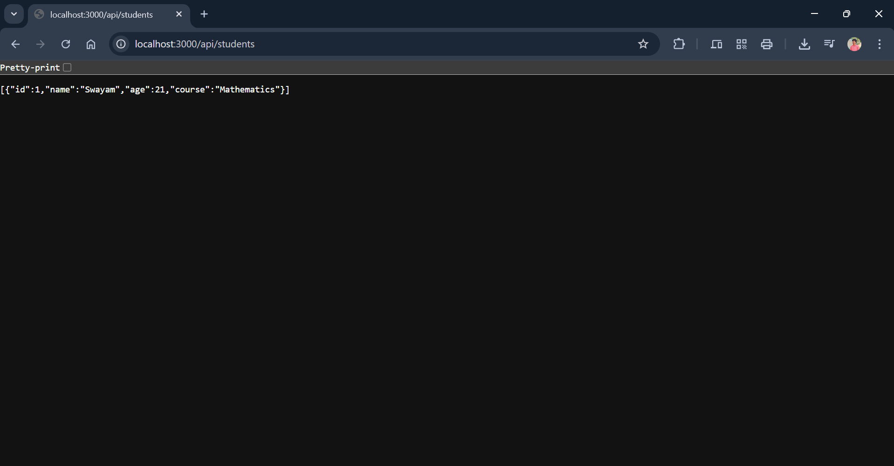

---

## **PROGRAM 9 – RESTful Student API with Node.js and Express**

---

### **AIM**

To implement a **RESTful API** for managing student data using **Node.js** and **Express**.

---

### **DESCRIPTION**

This experiment demonstrates how to build a simple REST API using **Node.js** and **Express**. The API allows users to perform **CRUD (Create, Read, Update, Delete)** operations on student records.

The data is stored **in-memory** for simplicity, simulating a backend service that can be extended with a database in real-world applications. This lightweight implementation is ideal for learning core API development concepts, including:

* Route handling
* JSON request/response processing
* Basic REST design principles

The solution uses **Express.js** for backend routing and **Node.js** as the runtime environment.

---

### **PROJECT STRUCTURE**

```
student-api/
│
├── server.js         # Main server file
├── package.json      # Project metadata and dependencies
├── node_modules/     # Installed npm modules
└── README.md         # Project documentation
```

---

### **Output**



---

### **INSTALLATION & SETUP**

#### **PREREQUISITES**

• Node.js

• VS Code or any preferred text editor

---

### **STEPS TO RUN THE PROJECT**

1. **Clone or Create the Project Folder**

```bash
mkdir student-api  
cd student-api
```

2. **Initialize Node.js Project**

```bash
npm init -y
```

3. **Install Express**

```bash
npm install express
```

4. **Create `server.js` File**
   Write your API logic in `server.js` (CRUD functionality for students).

5. **Start the Server**

```bash
node server.js
```

6. **Visit in Browser**

```
http://localhost:3000/api/students
```

---

### **API ENDPOINTS**

| Operation            | Method | Endpoint           | Description                  |
| -------------------- | ------ | ------------------ | ---------------------------- |
| Get All Students     | GET    | /api/students      | Fetch all student records    |
| Add a Student        | POST   | /api/students      | Add a new student            |
| Update Student by ID | PUT    | /api/students/\:id | Update student details by ID |
| Delete Student by ID | DELETE | /api/students/\:id | Delete student by ID         |

#### **POST Request Body Example**

```json
{
  "name": "Swayam",
  "age": 21,
  "course": "Mathematics"
}
```

---

### **SAMPLE OUTPUT**

```json
[
  {
    "id": 1,
    "name": "Swayam",
    "age": 21,
    "course": "Mathematics"
  }
]
```

---

### **LICENSE**

This project is **open-source** and free to use.

---

### **Author**

• **M. Swayam Prakash**

• GitHub: [https://github.com/swayamprakashm](https://github.com/swayamprakashm)

---
