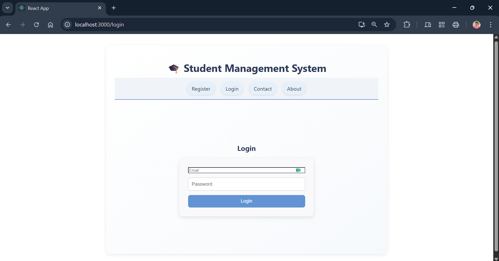
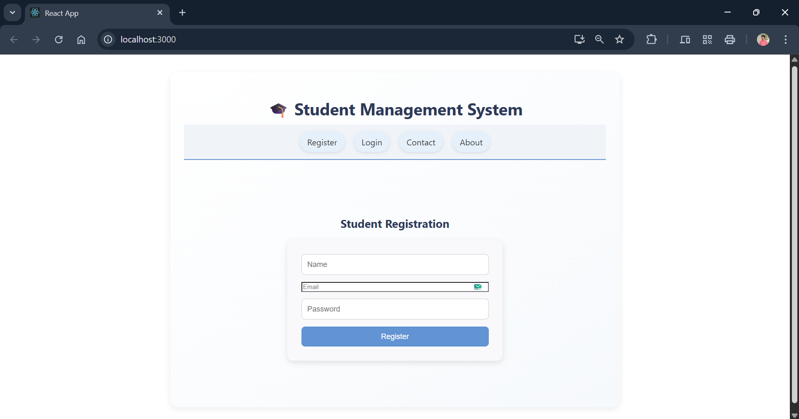
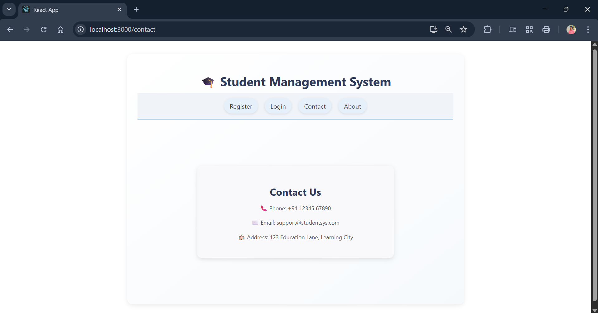
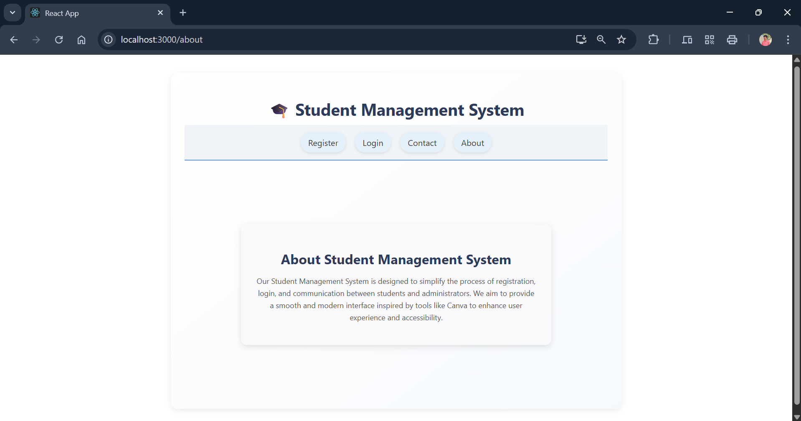

---

## **PROGRAM 11 – Student Management System with React**

---

### **AIM**

To develop a **student‑management system front end** using **React**, implementing navigation for **Registration**, **Login**, **Contact**, and **About** pages with **React Router**.

---

### **DESCRIPTION**

This experiment demonstrates how to build a **single‑page application (SPA)** with **React.js**. The app simulates a student‑management system and provides basic navigation among multiple pages. It leverages:

* **React Router** for client‑side routing
* **Component‑based architecture** for modular design

The project is ideal for beginners to learn the fundamentals of React, routing, JSX, component communication, and CSS styling.

---

### **PROJECT STRUCTURE**

```
student-management-react/
│
├── public/
│   └── index.html           # HTML template
│
├── src/
│   ├── components/
│   │   ├── About.js         # About page component
│   │   ├── Contact.js       # Contact page component
│   │   ├── Login.js         # Login page component
│   │   └── Registration.js  # Registration page component
│   ├── App.js               # Main app with routing
│   ├── App.css              # Styling for the app
│   ├── index.js             # Entry point of the React app
│   ├── App.css              # App‑level styles
│   ├── index.js             # React entry point
│   └── index.css            # Global styles
│
├── package.json             # Project metadata and dependencies
└── README.md                # Project documentation

```
---

### **Output**

Login page:


Registration page:


Contact Us page:


About page:


---

### **INSTALLATION & SETUP**

#### **PREREQUISITES**

• Node.js & npm

• VS Code (or any code editor)

• Basic knowledge of React

---

#### **STEPS TO RUN THE PROJECT**

1. **Create the project with Create React App**

   ```bash
   npx create-react-app student-management-react
   cd student-management-react
   ```

2. **Install React Router DOM**

   ```bash
   npm install react-router-dom
   ```

3. **Create component files**
   Inside `src/components/`, add:

   * `About.js`
   * `Contact.js`
   * `Login.js`
   * `Registration.js`
     Each should return basic JSX markup.

4. **Update `App.js` to implement routing**
   Use `BrowserRouter`, `Routes`, and `Route` from **react-router-dom** to map pages.

5. **Run the project**

   ```bash
   npm start
   ```

6. **Visit in browser**

   ```
   http://localhost:3000
   ```

---

### **LICENSE**

This project is **open‑source** and free to use.

---

### **Author**

• **M. Swayam Prakash**

• GitHub: [https://github.com/swayamprakashm](https://github.com/swayamprakashm)

---