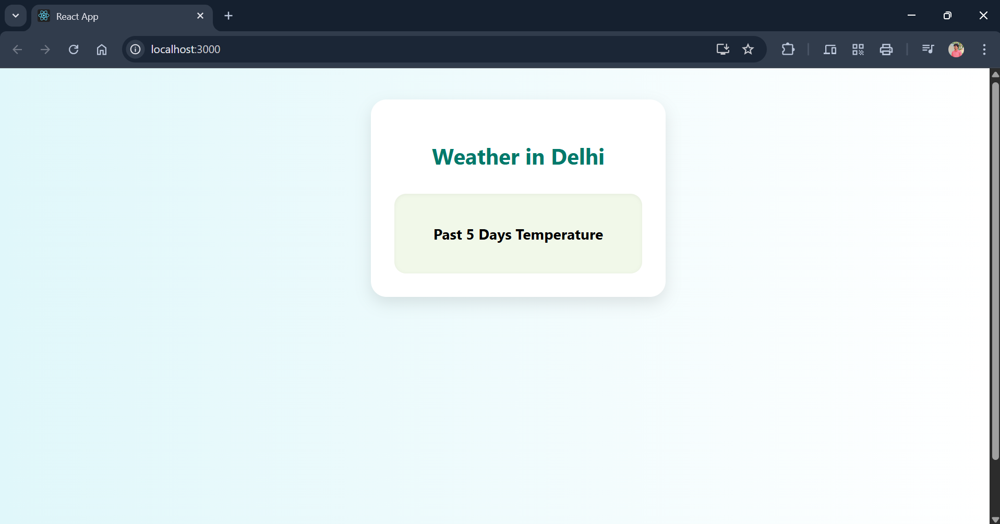

---

## **PROGRAM 12 – React Weather Services**

---

### **AIM**

To develop a weather information web application using **React** that fetches **current and historical weather data** from the **OpenWeatherMap API** and visualizes it using **Chart.js**.

---

### **DESCRIPTION**

This experiment demonstrates how to build a **real-time weather service** using **React.js**. The application:

* Displays **current weather**
* Shows **5-day temperature trends** in graphical format
* Fetches data using **OpenWeatherMap API**
* Visualizes it using **Chart.js**

The app features a **Canvas-style UI**, designed with CSS for a modern and responsive layout. This project helps users understand:

* **API integration**
* **Asynchronous data fetching**
* **Chart rendering with Chart.js**
* **React component-based design**

---

### **PROJECT STRUCTURE**

```
weather-app/
│
├── public/
│   └── index.html                # HTML template
│
├── src/
│   ├── components/
│   │   └── WeatherChart.js       # Chart.js line chart component
│   ├── services/
│   │   └── weatherService.js     # OpenWeatherMap API logic
│   ├── App.js                    # Main app logic and UI
│   ├── App.css                   # Canvas-style UI styling
│   ├── index.js                  # Entry point
│   └── index.css                 # Global styles
│
├── package.json                  # Metadata and dependencies
└── README.md                     # Project documentation
```

---

### **Output**



---

### **INSTALLATION & SETUP**

#### **PREREQUISITES**

• Node.js & npm

• VS Code or any preferred editor

• Basic knowledge of React and REST APIs

---

#### **STEPS TO RUN THE PROJECT**

1. **Create the project using Create React App**

```bash
npx create-react-app weather-app
cd weather-app
```

2. **Install Required Libraries**

```bash
npm install chart.js react-chartjs-2
```

3. **Set Up File Structure**
   Create folders:

```bash
mkdir src/components src/services
```

4. **Implement Weather Service**
   In `src/services/weatherService.js`, add logic to fetch weather data from OpenWeatherMap using `fetch` or `axios`.

5. **Create Chart Component**
   In `src/components/WeatherChart.js`, implement a **Line chart** using **Chart.js** and **react-chartjs-2**.

6. **Build the App Logic**

* Use `App.js` to:

  * Collect user input (e.g., city)
  * Fetch weather data via the service
  * Pass data to the chart component
* Style the UI using `App.css` for a **canvas/card-style layout**

7. **Run the Project**

```bash
npm start
```

8. **Visit in Browser**
   Open your browser at:

```
http://localhost:3000
```

---

### **LICENSE**

This project is **open-source** and free to use.

---

### **Author**

• **M. Swayam Prakash**

• GitHub: [https://github.com/swayamprakashm](https://github.com/swayamprakashm)

---