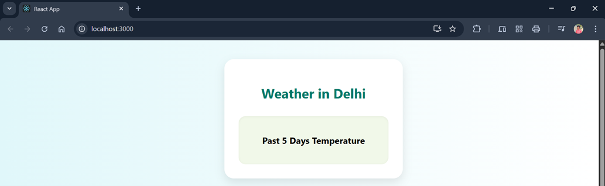

---

## **PROGRAM 15 – Django Weather App**

---

### **AIM**

To develop a **weather application frontend** using Django templating that displays **current weather information** and a **line chart** showing temperature trends over the past 5 days using **Chart.js**.

---

### **DESCRIPTION**

This experiment demonstrates how to create a Django-based weather application with dynamic weather data rendering and visualizations. Key features include:

* Fetching **real-time weather** data (temperature, description, icon)
* Rendering data using **Django templates**
* Displaying **historical temperature data** in a **line chart** using Chart.js
* Introducing integration between backend-rendered HTML and frontend JavaScript

This project helps beginners understand:

* **Django views and templates**
* **Dynamic context rendering**
* **JavaScript integration (Chart.js)** in Django apps

---

### **PROJECT STRUCTURE**

```
weather-app/
│
├── weather_app/                # Django app
│   ├── views.py                # Logic for fetching weather data
│   ├── urls.py                 # App-level routing
│   └── templates/
│       └── index.html          # Template with Chart.js and weather info
│
├── weather_project/            # Project configuration
│   ├── settings.py             # Project-wide settings
│   └── urls.py                 # Project-wide URL routing
│
├── static/                     # (Optional) CSS or JS files
│
├── db.sqlite3                  # Database (auto-generated)
├── manage.py                   # Django management utility
└── README.md                   # Documentation
```

---

### **Output**



---

### **INSTALLATION & SETUP**

#### **PREREQUISITES**

* Python 3.x
* Django (`pip install django`)
* Chart.js (included via CDN)
* Basic knowledge of Django and HTML templating

---

### **STEPS TO RUN THE PROJECT**

1. **Create Django Project and App**

```bash
django-admin startproject weather_project
cd weather_project
python manage.py startapp weather_app
```

2. **Configure URLs**

* In `weather_project/urls.py`, include the app’s routes:

```python
from django.urls import path, include
urlpatterns = [
    path('', include('weather_app.urls')),
]
```

3. **Set Up View**

* In `weather_app/views.py`, define a function to:

  * Fetch current weather via API
  * Prepare a 5-day temperature list
  * Pass the data to `index.html` via context

4. **Create Template**

* Place `index.html` in `weather_app/templates/`
* Use Django template tags (`{{ variable }}`) to render dynamic content
* Embed Chart.js via CDN in `<script>` tag for chart rendering

5. **Run the Server**

```bash
python manage.py runserver
```

6. **Access the Application**

* Open your browser and navigate to:

```
http://127.0.0.1:8000/
```

---

### **FEATURES**

* **Real-time** weather data
* **Django templating** for dynamic UI
* **Line chart** using Chart.js
* Clean and interactive **web interface**

---

### **LICENSE**

This project is **open-source** and free to use.

---

### **Author**

**M. Swayam Prakash**

GitHub: [https://github.com/swayamprakashm](https://github.com/swayamprakashm)

---