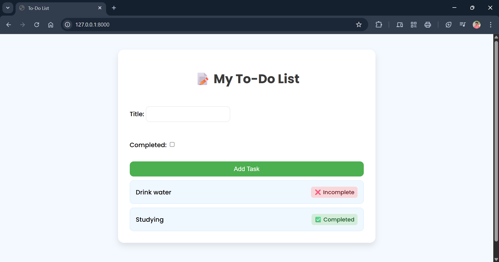

---

## **Program 16 – Django TODO App**

---

### **AIM**

To develop a **TODO list application backend** using **Django**, allowing users to add, view, and manage tasks with a clean and functional web interface.

---

### **DESCRIPTION**

This experiment demonstrates how to build a server-rendered TODO application using Django. The app allows users to manage tasks—such as adding new tasks and viewing task lists—using Django’s powerful **Model-View-Template (MVT)** architecture.

It showcases key Django concepts like **models**, **views**, **templates**, **forms**, and **URL routing**. This project is ideal for beginners to learn about **Django’s ORM**, **template rendering**, and basic **backend development**.

---

### **PROJECT STRUCTURE**

```
django_todo_app/
│
├── todo_project/              # Project settings folder
│   ├── __init__.py
│   ├── settings.py            # Project configuration
│   ├── urls.py                # Root URL configuration
│   └── wsgi.py                # WSGI entry point
│
├── todo/                      # Main app folder
│   ├── migrations/
│   ├── templates/
│   │   └── todo/
│   │       └── index.html     # HTML template for the app
│   ├── __init__.py
│   ├── admin.py               # Admin interface
│   ├── apps.py
│   ├── models.py              # Task model
│   ├── views.py               # Logic for handling requests
│   └── urls.py                # URL routing for the app
│
├── db.sqlite3                 # SQLite database
├── manage.py                  # Django management script
└── README.md                  # Project documentation
```

---

### **Output**



---

### **INSTALLATION & SETUP**

#### **PREREQUISITES**

• Python 3.8+

• pip (Python package installer)

• VS Code or any preferred code editor

• Basic knowledge of Django

---

### **STEPS TO RUN THE PROJECT**

#### **1. Create Project and App**

```bash
django-admin startproject todo_project  
cd todo_project  
python manage.py startapp todo
```

#### **2. Define Model in `todo/models.py`**

```python
from django.db import models

class Task(models.Model):
    title = models.CharField(max_length=200)
    completed = models.BooleanField(default=False)

    def __str__(self):
        return self.title
```

#### **3. Create and Apply Migrations**

```bash
python manage.py makemigrations  
python manage.py migrate
```

#### **4. Set Up Views, Templates, and URLs**

* Write logic in `views.py` to render the task list.
* Create the template: `templates/todo/index.html`.
* Map URLs in `todo/urls.py` and include them in `todo_project/urls.py`.

#### **5. Run the Project**

```bash
python manage.py runserver
```

#### **6. Visit in Browser**

Open your browser and navigate to:

```
http://127.0.0.1:8000/
```

---

### **LICENSE**

This project is **open-source** and free to use.

---

### **Author**

• **M. Swayam Prakash**

• GitHub: [https://github.com/swayamprakashm](https://github.com/swayamprakashm)

---