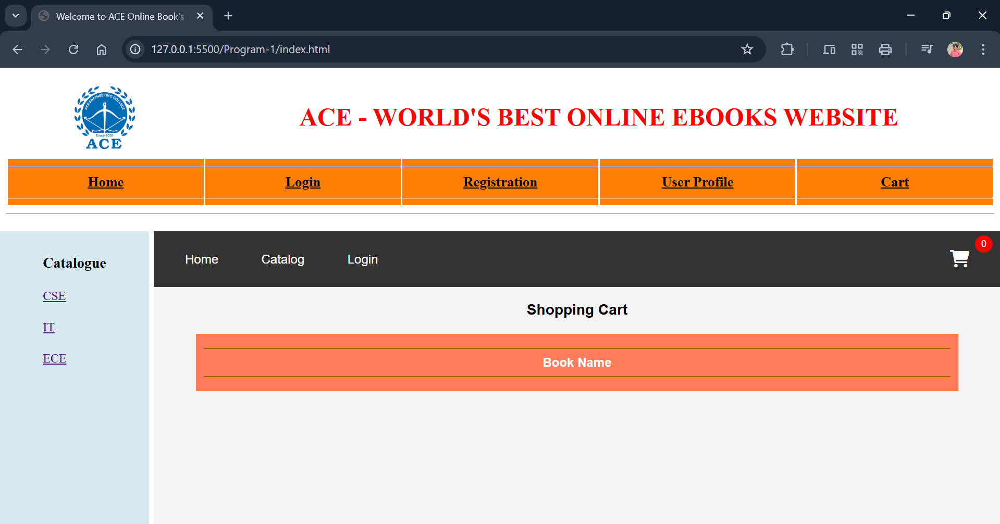
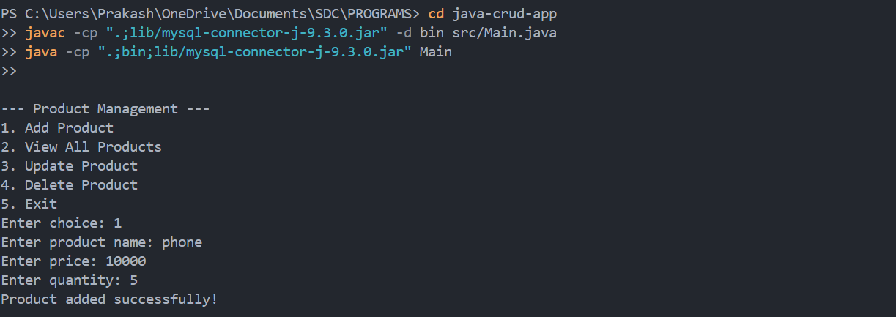
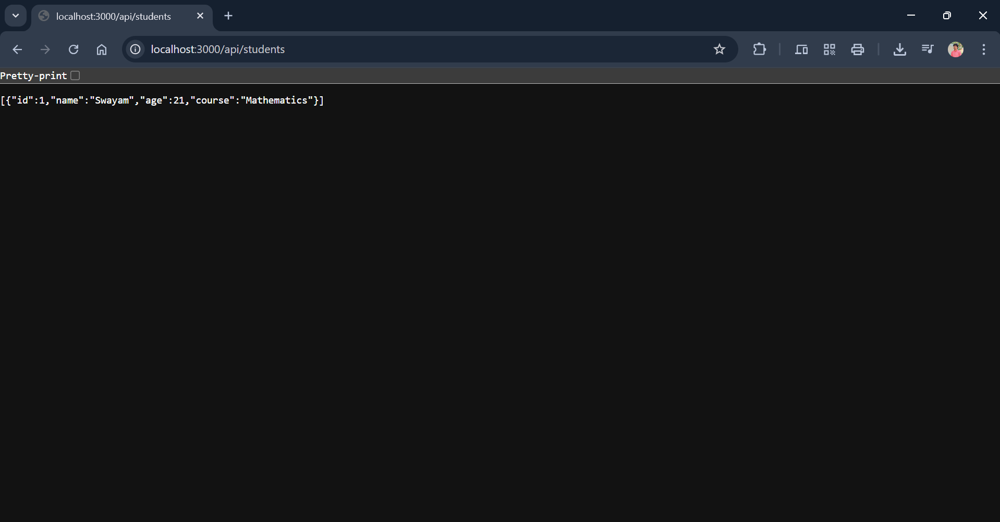
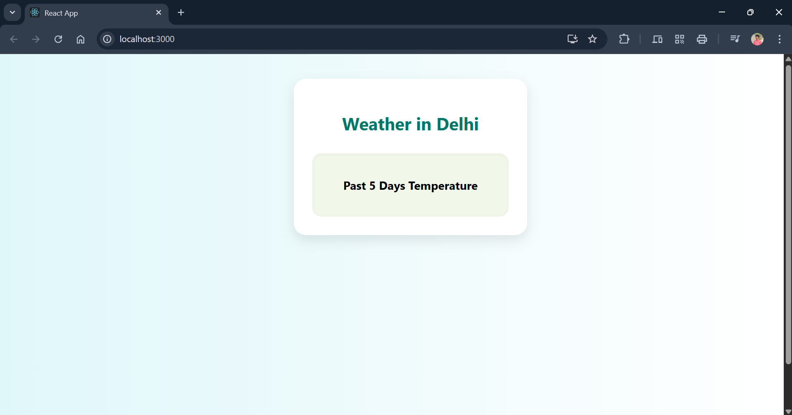

---

# Skill Development Lab – Full Stack Experiments

---
Welcome to the **Skill Development Lab** repository!  
This collection contains **16 hands-on experiments** designed to help students and beginners learn modern web and software development skills across **Frontend, Backend, and Full Stack** technologies.

Each folder contains code and files for a specific experiment, named accordingly.

---

## What You’ll Learn

- Frontend Development  
- Responsive Web Design  
- JavaScript & ES6  
- Java & MySQL (CRUD)  
- Java Servlet (MVC)  
- Session Management  
- Node.js (REST APIs, Authentication)  
- React.js (SPA, Routing, Services)  
- Django (Python Full-Stack)  
- OpenWeatherMap API Integration  
- Chart.js (Data Visualization)  

---

## List of Experiments & Technologies Used

| S.no | Experiment             | Description                         | Technology                  |
|-------|-----------------------|-----------------------------------|-----------------------------|
| 01    | Shopping Cart – CSS     | Basic shopping cart using Flex & Grid | HTML, CSS3                |
| 02    | Shopping Cart – Bootstrap | Responsive cart using Bootstrap   | HTML, Bootstrap             |
| 03    | Form Validation        | Client-side form validation         | JavaScript                  |
| 04    | Weather Info App       | Fetch weather data & show graph     | ES6, Fetch API, Chart.js    |
| 05    | Java CRUD              | Perform Create, Read, Update, Delete | Java, JDBC, MySQL         |
| 06    | Servlet Controller     | Connect frontend to DB using Servlet | Java Servlets, JSP         |
| 07    | Session Management     | User session tracking               | Cookies, HTTP Session       |
| 08    | NodeJS Server          | Custom server, use modules          | Node.js, HTTP, OS, path     |
| 09    | Student API            | RESTful API to manage students      | Node.js, Express            |
| 10    | Auth API               | JWT-based secure endpoints          | Node.js, Express, JWT       |
| 11    | React App – Student Mgmt | SPA with routing & forms           | React.js, React Router      |
| 12    | React Weather App      | Fetch & graph weather data          | React, Chart.js, OpenWeatherMap |
| 13    | React TODO App         | Basic TODO with components          | React.js                   |
| 14    | Django – Student Mgmt  | Django app with routing             | Django (Python)             |
| 15    | Django Weather App     | Fetch & graph weather info          | Django, Chart.js            |
| 16    | Django TODO App        | Basic TODO app using Django         | Django (Python)             |

---

##  Experiment Screenshots
### Experiment 01 – Shopping Cart (CSS)



### Experiment 02 – Shopping Cart (Bootstrap)


### Experiment 03 – Form Validation


### Experiment 04 – Weather Info App


### Experiment 05 – Java CRUD


### Experiment 06 – Servlet Controller


### Experiment 07 – Session Management


### Experiment 08 – NodeJS Server


### Experiment 09 – Student API


### Experiment 10 – Auth API (JWT)


### Experiment 11 – React App (Student Mgmt)


### Experiment 12 – React Weather App


### Experiment 13 – React TODO App


### Experiment 14 – Django Student Mgmt


### Experiment 15 – Django Weather App


### Experiment 16 – Django TODO App


---

## How to Use This Repository

### 1. Clone the Repository

```bash
git clone https://github.com/swayamprakashm/Skill-Development-Lab.git

cd Skill-Development-Lab 
````

### 2. Open Specific Experiment

Use **VS Code** or any IDE of your choice to explore each folder.

### 3. Run Web Projects

* Open `index.html` directly in a browser *(for HTML/CSS/JS tasks)*
* Use `npm` / `node` for Node.js experiments
* Use `python manage.py runserver` for Django apps
* Use `javac` / `java` for Java-based tasks

---

## External Tools & APIs Used

* **OpenWeatherMap.org** – For real-time weather data
* **Chart.js** – For data visualization (React & Django)
* **MySQL / Oracle DB** – For backend Java persistence
* **JWT** – For API authentication in Node.js

---

## Author

**M Swayam Prakash**

Passionate about full-stack development and building impactful projects with modern web technologies.

---

## Suggestions

* **Beginners:** Start with Experiments 1–4 to get comfortable with HTML/CSS/JS
* **Intermediate:** Try Experiments 5–10 to build your backend skills
* **Advanced:** Explore React and Django projects (11–16)

---

## License

This repository is open for learning and educational use.

---
This project is **open-source** and free to use.

---

### **GitHub** 

[https://github.com/swayamprakashm](https://github.com/swayamprakashm)

---